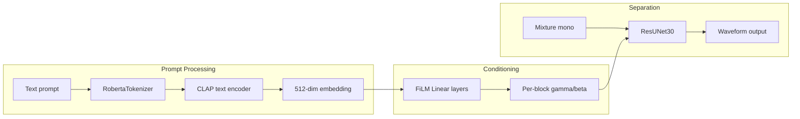

# AudioSep Technical Documentation

Technical documentation for the AudioSep cx_Freeze runtime: architecture, prompt-to-operation flow, and improvements over the upstream model.

## Overview and Attribution

This repo packages [AudioSep](https://github.com/Audio-AGI/AudioSep) into a minimal, inference-only worker. AudioSep is a foundation model for open-domain audio source separation using natural language queries.

- **Original project:** https://github.com/Audio-AGI/AudioSep
- **Paper:** [Separate Anything You Describe](https://arxiv.org/abs/2308.05037) (Liu et al., 2023)

## Architecture

The model has three main components:

1. **CLAP (Contrastive Language-Audio Pretraining)** — Text encoder that maps prompts to 512-dim embeddings
2. **FiLM (Feature-wise Linear Modulation)** — Maps embeddings to per-layer scaling factors for the decoder
3. **ResUNet30** — U-Net-style separation network with FiLM conditioning

### Config

From `config/audiosep_base.yaml`:

- `input_channels: 1`, `output_channels: 1` — **mono-only** by design
- `sampling_rate: 32000` — Model native rate
- `condition_size: 512` — CLAP embedding dimension

## Prompt-to-Operation Flow

### Data Flow

1. **Text → Embedding** (`models/clap_encoder.py`):
   - `get_query_embed(modality='text', text=[prompt])` → `_get_text_embed()`
   - RobertaTokenizer (max 512 tokens) → CLAP `get_text_embedding()` → 512-dim float vector, L2-normalized

2. **Embedding → FiLM conditioning** (`models/resunet.py`):
   - FiLM maps 512-dim condition to per-decoder-block scaling: `gamma, beta = Linear(condition)[:, :, None, None]`
   - Each ResUNet decoder block applies: `x = gamma * x + beta` (Feature-wise Linear Modulation)

3. **Single operation:** The model is trained to output the **target source** described by the text. There is no explicit "operation type" — the network learns prompt → source mapping end-to-end.

**Implication:** The model does one thing: **extract** the source matching the prompt. It does not natively support "remove", "enhance", or "denoise" as distinct operations.

## Original AudioSep Stereo Strategy

**Finding:** The original AudioSep model is **mono-only** by design.

- Config defines `input_channels: 1`, `output_channels: 1`
- ResUNet30 architecture is built for single-channel I/O
- The upstream Audio-AGI/AudioSep repo uses `librosa.load(..., mono=True)` and outputs mono

## Our Improvements

### 1. Stereo Output (Per-Channel Processing)

**File:** `pipeline.py`

- Load with `mono=False` to preserve stereo
- Process L and R separately via `_run_separation()` for each channel
- Stack results for real stereo output; mono input gets duplicated to L=R
- Matches professional approach used by Demucs, BS-Roformer

### 2. 44.1 kHz Output

- Model runs at 32 kHz (native rate)
- Resample from 32 kHz → 44.1 kHz before writing (for DAW compatibility)
- Uses `librosa.resample(..., res_type="polyphase")` (SciPy-based, no extra deps)

### 3. mmap Fix

**File:** `utils.py`

- Do not pass `mmap` to `AudioSep.load_from_checkpoint()` — Lightning passes `**kwargs` to `__init__`, but AudioSep rejects `mmap`
- CLAP mmap still controlled via `AUDIOSEP_MMAP_LOAD` env

## Prompt Best Practices

| Prompt | Use case |
|--------|----------|
| `vocals` | Vocal extraction (plural) |
| `singing` | Singing voice |
| `speech` | Spoken word |
| `voice` | Human voice |
| `bass`, `drums`, `music` | Instruments |
| `harmonica` | Specific instrument |

Different prompts produce different outputs (verified via MD5 comparison). Try `vocals`, `singing`, or `speech` for vocal isolation.

## Extending to More Operations

**Current limitation:** The ResUNet + FiLM architecture is fixed. The prompt only selects *which* source to extract, not *what to do* with it.

**Possible extensions (without retraining):**

| Operation | Implementation |
|-----------|----------------|
| **Remove X** | `output = mixture - extract(X)` (requires mixture and extract in same space) |
| **Isolate X** | Already supported — same as extract |
| **Background / accompaniment** | Extract "music" or "instrumental", or `mixture - extract("vocals")` |

**Requires new work:**
- **Enhance / denoise:** Would need a different model or fine-tuned variant
- **Prompt routing:** Parse prompt (e.g. "remove vocals") → run extract("vocals") → subtract from mixture. This is a thin wrapper, not a model change.

## Limitations

- **Mono model:** Architecture is single-channel; we add stereo via per-channel processing
- **Single operation type:** Only extract; no native remove/enhance/denoise
- **Separation quality:** May differ from dedicated vocal separators (e.g. Demucs) for vocal isolation
